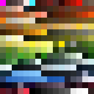
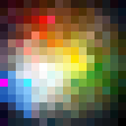
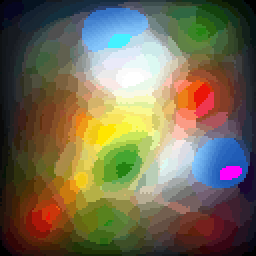
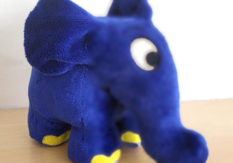

# Pixel Sorter

Sorts the pixels of an image based on their color.

Before vs after:

<p>
	
	
</p>

Here's the `before` palette pasted 4 times into the shape of a heart, and then sorted:

https://github.com/MyNameIsTrez/pixel-sorter/assets/32989873/3a71be22-17b2-4e5f-8d89-183eb4c8907f

Here's the `before` palette pasted 64 times and sorted:



Sorting an image blurs it, but the difference with normal blurring is that all of the original pixels are still there; the pixels have just been swapped around. In the below image the left half is untouched, and the right half is the blurry result after sorting:

<p></p>

## How it works

The program repeatedly attempts to swap two random pixels, only performing the swap if that'd place them next to pixels with more similar colors.

At the heart of the program lies my PyOpenCL port of [CUDA-Shuffle](https://github.com/djns99/CUDA-Shuffle)'s `LCGBijectiveFunction` shuffling class.

Before sorting, `rgb2lab.py` is used to convert the pixels of the input image from RGB to CIELAB colors. CIELAB colors were designed based on empirical studies of how the human eye perceives color, and it allows us to do significantly more accurate color comparisons than can be done with RGB.

The [Color difference](https://en.wikipedia.org/wiki/Color_difference) article on Wikipedia describes how uniform color spaces like CIELAB allow getting an accurate color difference score with the formula `(R1 - R2)^2 + (G1 - G2)^2 + (B1 - B2)^2`, where `R1` is the red value of the 1st pixel:

> Uniform color space: a color space in which equivalent numerical differences represent equivalent visual differences, regardless of location within the color space.

`lab2rgb.py` is used at the end of the program to convert the sorted CIELAB pixels back to RGB pixels. This is a completely lossless process.

To show that RGB doesn't reflect how the human eye perceives color, here's the same heart video from before, but with color comparisons done in RGB. Notice the green splotches that look out of place:

https://github.com/MyNameIsTrez/pixel-sorter/assets/32989873/e36952c7-fbaf-4745-ad10-cd145d844d64

## Installation

1. Clone this repository and `cd` into it
2. Install the requirements by running `pip install -r requirements.txt`
3. See all the options by running `python sort.py --help`

## Usage

1. Generate `heart_rgb2lab.npy` by running `python rgb2lab.py input/heart.png input_npy/heart_rgb2lab.npy`
2. Start sorting by running `python sort.py input_npy/heart_rgb2lab.npy output_npy/heart_rgb2lab.npy` (if the program prints `pyopencl._cl.LogicError: clGetPlatformIDs failed: PLATFORM_NOT_FOUND_KHR`, it means you need to install OpenCL)

To track the sorting progress, you can open another terminal and run `python lab2rgb.py output_npy/heart_rgb2lab.npy output/heart_lab2rgb.png`, which outputs `output/heart_lab2rgb.png`.

Once you're satisfied with the result, you can stop the sorting by pressing Ctrl+C.

## Other included programs

### verify.py

Verifies that the color counts of the input and output image are identical.

If the color counts aren't identical and you started the program with VS Code's Python debugger, the VS Code `Run and Debug` view on the left allows you to inspect the colors and counts of the input and output image.

`rgb2lab.py` converts an RGB image to LAB values, and writes it to a numpy `.npy` binary file. `lab2rgb.py` converts that back to an RGB image. `sort.cpp` takes this `.npy` file as an input, and outputs another `.npy` file. This frees `sort.py` from needing color conversion code.

Example usage:

1. `python rgb2lab.py input/heart.png output/heart_rgb2lab.npy`
2. `python lab2rgb.py output/heart_rgb2lab.npy output/heart_lab2rgb.png`
3. `python verify.py input/heart.png output/heart_lab2rgb.png`

If you open this repository in VS Code, you can launch and configure these programs using the `.vscode/launch.json` file.

### fill_mask.py

Puts the opaque pixels of an input image into the white pixels of an input mask, and writes the result to an output image.

The heart shape was created using this program, from `input/heart.png` and the heart-shaped mask `masks/heart_1024.png`.

### shuffle.py

Shuffles the opaque pixels of an input image, and writes the result to an output image.

## How to turn the output images into videos

### webm

`ffmpeg -framerate 1 -i output/elephant_%04d.png -crf 0 -s 1024x662 -sws_flags neighbor -r 30 output/output.webm`

### mp4

mp4 files are larger and of lower quality than webm files, but are more widely supported.

`ffmpeg -framerate 1 -i output/elephant_%04d.png -crf 0 -s 1024x662 -sws_flags neighbor -c:v libx264 -pix_fmt yuv420p -r 30 output/output.mp4`

### gif

`ffmpeg -framerate 10.0 -i local/media/gifs/%1d.png -s 160x160 -sws_flags neighbor -r 30 output/gif.gif`

## Profiling cpp/main.cpp

Clone [FlameGraph](https://github.com/brendangregg/FlameGraph), open a terminal in that directory, and run these commands:

```bash
sudo perf record -F 99 -p $(pgrep a.out) -g -- sleep 10 &&
sudo perf script > out.perf &&
./stackcollapse-perf.pl out.perf > out.folded &&
./flamegraph.pl out.folded > kernel.svg
```

Open `kernel.svg` in your browser and click around.

Manually regenerating the gcda files is necessary for some reason, rather than being able to launch the program with VS Code debugger.
To do this you first need to recompile with `c++ -Wall -Wextra -Werror -Wpedantic -Wfatal-errors -g -std=c++17 -DNDEBUG -Ofast -march=native -fprofile-generate cpp/main.cpp cpp/cnpy.cpp -lz`
And then you need to run it for at least a few seconds with `./a.out output_npy/big_palette.npy output_npy/big_palette.npy --kernel-radius 200 --seconds-between-saves 60 --sort-minority-threshold 900`

Generate an image with `python3 lab2rgb.py output_npy/big_palette.npy output/big_palette.png`

You can view the generated assembly with Compiler Explorer [here](https://godbolt.org/z/Tjbrqn6b6).

`perf top -a` is an excellent sampler for finding assembly instructions that take the biggest percentage of the program's time, and it even shows the original lines alongside the assembly!
